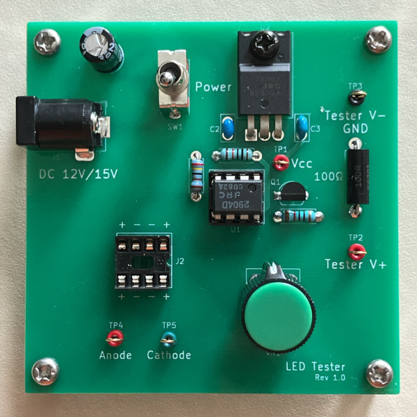
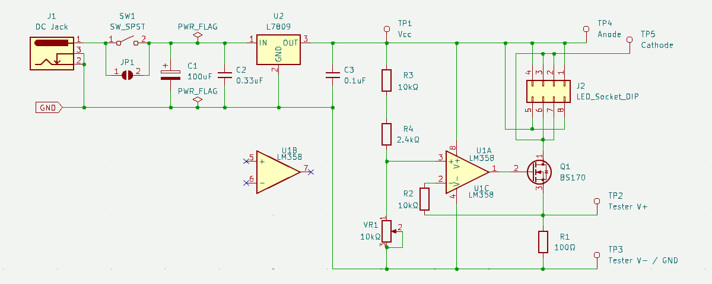
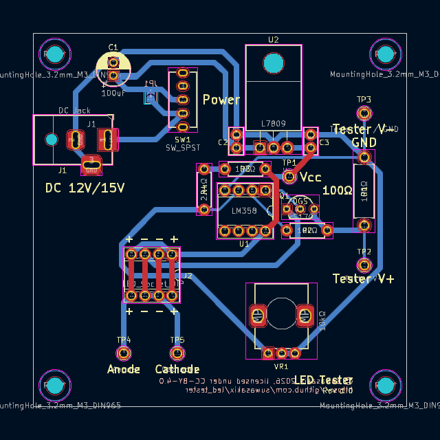
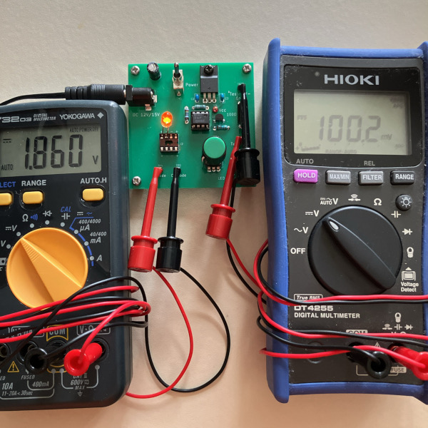

# LED Tester

LED テスター

&nbsp;

## 目次 - Contents

 - [このプリント基板について](#このプリント基板について---about-this-pcb)
 - [ガーバーデータのダウンロード](#ガーバーデータのダウンロード---download-gerber-data)
 - [回路図](#回路図---pcb-schematic)
 - [レイアウト](#レイアウト---pcb-layout)
 - [部品リスト](#部品リスト---parts-list)
 - [便利なアイテム](#便利なアイテム---useful-items)
 - [使用例](#使用例---example-of-use)
 - [開発環境](#開発環境---development-environment)
 - [ライセンスについて](#ライセンスについて---license)

&nbsp;

## このプリント基板について - About this PCB

このプリント基板は、LED のテスター回路を実装したものです。  

この基板はボリュームで電流値をコントロール可能な定電流回路を実装しており、電流に応じた LED の照度や順方向電圧の確認に使用することができます。  

念のために書いておくと、[OptoSupply の LED テスター][AK_101860_LED_TESTER] が秋月電子通商で売っています。どちらを選ぶかはお好みで。  

&nbsp;

## ガーバーデータのダウンロード - Download gerber data

こちらのページから「led_tester-gerber.zip」のファイルをダウンロードしてください。  

&emsp; https://www.github.com/suwasakix/led_tester/releases

このプロジェクトは、各自がプリント基板のガーバーデータをダウンロードして PCB 基板メーカーに基板製造を発注することを前提にしています。個人で発注可能な PCB 基板メーカーは国内外問わずありますが、近年では 10cm 四方以下の基板サイズであれば海外メーカーで格安に製造委託することが可能になりました。発注例として、深圳の Seeed studio が提供する PCB 製造サービス「[Fusion PCB](https://www.fusionpcb.jp)」に基板製造を発注する方法を[こちらのページ](docs/ORDER_PCB.md)で紹介しておきます。  

&nbsp;

## 回路図 - PCB schematic

定電流回路はオペアンプを使用したオーソドックスな回路です。オペアンプには差動入力（＋端子と－端子）が同じ電圧となろうとする性質があるので、LED に電流が流ているとき VR1 の両端にかかる電圧と R1 の両端にかかる電圧はほぼ同じ値になります（R2 に電流はほとんど流れません）。VR1 を調整することによって LED に流れる電流をコントロールすることができるという仕組みです。  

Vcc (9V) を 12.4kΩ と 10kΩ で分圧したとき 10kΩ には約4V の電圧がかかることになるので、VR1 を調整することによって LED に流れる電流を最大 40mA 程度にまで変えることが可能です。ですが、最大電流が大きいと 1mA 単位の調整が難しくなるので、R4 を 18kΩ～22kΩ にして最大 20mA くらいにした方が使いやすいかもしれません。分圧比は各自の好みに応じて変更して頂いて問題ありませんが、最大電流は 50mA を超えないようにしてください。  

R1 は電流値を測定するための抵抗なので高精度品か、あるいは抵抗値を実測してなるべく 100Ω に近いものを使用してください。ワット数は 1/2W 以上のものを使用してください。  

R2 は他の作例を参考にして入れたものですが、おそらく 0Ω でも問題なく動作すると思います。  

VR1 には秋月電子通商で取り扱いのある基板取付用ボリューム RK09D117000B を採用しました。ボリュームの軸が長いので鋸などで軸を切って使用する場合には、必ず軸側を保持して切り落とすようにしてください。ボリューム本体側を保持して軸を切ろうとすると、ボリュームにストレスがかかって故障の原因になります。  

電源には 12V または 15V の AC アダプターを使用してください。DC ジャックは 外径 5.5mm / 内径 2.1mm センタープラスのものが適合します。 

&nbsp;

## レイアウト - PCB layout

* 基板サイズ : W 70mm × H 70mm

&nbsp;

## 部品リスト - Parts list

* 通販による部品販売では、10個単位などでまとめ売りされている場合がしばしばあります。注文の際にはご注意ください。
* ★ は省略可。
* ☆ は使用しなければ省略可。

|部品種別			|記号					|部品名															|値				|個数		|入手ルート																											|
|:----:				|:----:					|:----:															|:----:			|:----:		|:----:																												|
|抵抗				|R1						|金属皮膜抵抗 1/2W												|100Ω			|1			|[高精度 金属皮膜抵抗 1/2W100Ω ±0.1%][AK_108509_R100]																|
|					|R2, R3					|金属皮膜抵抗 1/4W												|10kΩ			|2			|[超小型 金属皮膜抵抗 1W10kΩ 1袋100本入][AK_108839_R10k]															|
|					|R4						|金属皮膜抵抗 1/4W												|2.2kΩ～2.4kΩ	|1			|[超小型 金属皮膜抵抗 1W2.2kΩ 1袋100本入][AK_108832_R2.2k]															|
|ボリューム			|VR1					|基板取付用ボリューム 10kΩBカーブ RK09D117000B				|10kΩ			|1			|[基板取付用ボリューム 10kΩB][AK_114827_VR10kB_RK09D117000B] [ボリューム用ツマミ][AK_C_CKNOB]					|
|コンデンサ			|C1						|電解コンデンサ (直径 6.3mm, リードピッチ 2.5mm)			|100μF			|1			|[100μF35V105℃ ルビコンZLH][AK_102724_C35v100u]																	|
|					|C2						|積層セラミックコンデンサ (リードピッチ 2.54mm)				|0.33μF		|1			|[積層セラミックコンデンサー 0.33μF50V X7R 2.54mmピッチ][AK_115937_C50v0.33u]										|
|					|C3						|積層セラミックコンデンサ (リードピッチ 2.54mm)				|0.1μF			|1			|[積層セラミックコンデンサー 0.1μF50V X7R 2.54mm][AK_113582_C50v0.1u]												|
|FET				|Q1						|BS170															|-				|1			|[Nch MOSFET BS170-D27Z][AK_130394_BS170]																			|
|IC					|U1						|２回路単電源オペアンプ LM358/LM2904							|-				|1			|[2回路入汎用オペアンプ NJM2904D][AK_109216_NJM2904D]																|
|					|U2						|TO-220型 9V ３端子レギュレータ									|-				|1			|[三端子レギュレーター 9V1.5A NJM7809FA][AK_100162_NJM7809FA]														|
|スイッチ			|SW1 ★					|トグルスイッチ (3P 1回路2接点 ON-ON)						|-				|1			|[2MS1-T1-B4-M2-Q-E][AK_102399_SW_2MS1-T1-B4-M2-Q-E] [2MS1-T1-B4-VS2-Q-E-S][AK_100300_SW_2MS1-T1-B4-VS2-Q-E-S]	|
|チェック端子		|TP1 ～ TP5 ☆			|チェック端子													|-				|5			|[チェック端子][AK_C_CCHECKTER]																						|
|ソケット			|J1						|基板型DCジャック (内径2.1mm, 外径5.5mm, 定格15V以上)		|-				|1			|[2DC0005D100 1パック4個入][AK_101604_2DC0005D100]																	|
|					|J2 ☆					|8ピン 板バネICソケット											|-				|1			|[2227-08-03 1パック10個入][AK_100017_2227-08-03]																	|
|基板スペーサー		|						|黄銅六角スペーサー M3×10mm									|-				|4			|[FB3-10][AK_107313_FB3-10]																							|
|					|						|M3 ネジ								 						|-				|4			|(ホームセンター等で入手可能)																						|

[AK_108509_R100]:								https://akizukidenshi.com/catalog/g/g108509/
[AK_108832_R2.2k]:								https://akizukidenshi.com/catalog/g/g108832/
[AK_108839_R10k]:								https://akizukidenshi.com/catalog/g/g108839/
[AK_114827_VR10kB_RK09D117000B]:				https://akizukidenshi.com/catalog/g/g114827/
[DK_RK09D117000B]:								https://www.digikey.jp/ja/products/detail/alps-alpine/RK09D117000B/21721587
[AK_102724_C35v100u]:							https://akizukidenshi.com/catalog/g/g102724/
[AK_113582_C50v0.1u]:							https://akizukidenshi.com/catalog/g/g113582/
[AK_115937_C50v0.33u]:							https://akizukidenshi.com/catalog/g/g115937/
[AK_130394_BS170]:								https://akizukidenshi.com/catalog/g/g130394/
[AK_100162_NJM7809FA]:							https://akizukidenshi.com/catalog/g/g100162/
[AK_109216_NJM2904D]:							https://akizukidenshi.com/catalog/g/g109216/
[AK_102399_SW_2MS1-T1-B4-M2-Q-E]:				https://akizukidenshi.com/catalog/g/g102399/
[AK_100300_SW_2MS1-T1-B4-VS2-Q-E-S]:			https://akizukidenshi.com/catalog/g/g100300/
[AK_C_CKNOB]:									https://akizukidenshi.com/catalog/c/cknob/
[AK_C_CCHECKTER]:								https://akizukidenshi.com/catalog/c/ccheckter/
[AK_101604_2DC0005D100]:						https://akizukidenshi.com/catalog/g/g101604/
[AK_100017_2227-08-03]:							https://akizukidenshi.com/catalog/g/g100017/
[AK_107313_FB3-10]:								https://akizukidenshi.com/catalog/g/g107313/
[AK_116915_LED_OSO5PA5A33A-1MA]:				https://akizukidenshi.com/catalog/g/g116915/
[SG_EEHD-65V4_LED_L053PSRD]:					https://www.sengoku.co.jp/mod/sgk_cart/detail.php?code=EEHD-65V4
[SG_EEHD-53AM_LED_L053YD]:						https://www.sengoku.co.jp/mod/sgk_cart/detail.php?code=EEHD-53AM
[SG_EEHD-4FE4_LED_L053GD]:						https://www.sengoku.co.jp/mod/sgk_cart/detail.php?code=EEHD-4FE4
[AK_101860_LED_TESTER]:							https://akizukidenshi.com/catalog/g/g101860/

R1 は金属皮膜抵抗の高精度品を使用するか、あるいは誤差±1%の金属皮膜抵抗から選別したものを割り当てます。普及価格帯のデジタルマルチメーターの場合、抵抗値の確度（測定誤差）はおおよそ ±0.5% ～ ±1.0% といったところなので、高精度品を使用した方が外れは少ないことになります。ただし、高精度品を使用する場合でも部品の不良チェックのために抵抗値は実測しておくようにしてください。  

VR1 の RK09D117000B は秋月電子通商のほかに [DigiKey][DK_RK09D117000B] などでも取り扱いがあります。  

U1 のオペアンプは、基板に [ICソケット][AK_100017_2227-08-03] を取り付けてソケットにオペアンプを挿した方が融通が利きます。  

SW1 は電源スイッチですが、省略することもできます。省略する場合は JP1 のパターンをショートしてください。  

J2 は LED 用のソケットです。使わないソケットは省略することもできます。TP2 ～ TP3 から線出しして IC クリップで測定する LED を繋いでもよいです。  

&nbsp;

## 便利なアイテム - Useful items

|部品名																			|入手ルート																																				|
|:----:																			|:----:																																					|
|ACアダプター 12V (DCプラグ内径2.1mm, 外径5.5mm, センタープラス)			|[M120100-A010JP][AK_117429_ACDC12V_M120100-A010JP] [AD-M120P100][AK_111994_ACDC12V_AD-M120P100] [AD-K120P100][AK_106642_ACDC12V_AD-K120P100]		|
|ACアダプター 15V (DCプラグ内径2.1mm, 外径5.5mm, センタープラス)			|[ATS024T-W150U][AK_108404_ACDC15V_ATS024T-W150U] [AD-B150P80][AK_111994_ACDC15V_AD-B150P80]															|
|テストリード (バナナプラグ ⇔ ICクリップ)									|[TLA-106][AK_112359_TLA-106]																															|
|テストリード (ICクリップ両端)												|[TLA-105][AK_112419_TLA-105] [TLA-101][AK_111765_TLA-101]																							|

[AK_117429_ACDC12V_M120100-A010JP]:				https://akizukidenshi.com/catalog/g/g117429/
[AK_111994_ACDC12V_AD-M120P100]:				https://akizukidenshi.com/catalog/g/g111994/
[AK_106642_ACDC12V_AD-K120P100]:				https://akizukidenshi.com/catalog/g/g106642/
[AK_108404_ACDC15V_ATS024T-W150U]:				https://akizukidenshi.com/catalog/g/g108404/
[AK_111994_ACDC15V_AD-B150P80]:					https://akizukidenshi.com/catalog/g/g111999/
[AK_112359_TLA-106]:							https://akizukidenshi.com/catalog/g/g112359/
[AK_112419_TLA-105]:							https://akizukidenshi.com/catalog/g/g112419/
[AK_111765_TLA-101]:							https://akizukidenshi.com/catalog/g/g111765/

## 使用例 - Example of use

写真は [OptoSupply OSO5PA5A33A-1MA][AK_116915_LED_OSO5PA5A33A-1MA] を測定した例で、1mA 流したときの順方向電圧は 1.86V です。  

何種類かの LED を２個ずつ実測した結果を下表に示します。LED の順方向電圧は型番によって違いがありますが、電流が少ない範囲内では個体差はほぼないといえそうです。  

|型番																|1.0mA		|2.0mA		|5.0mA		|10mA		|20mA		|
|:----:																|:----:		|:----:		|:----:		|:----:		|:----:		|
|[OptoSupply OSO5PA5A33A-1MA][AK_116915_LED_OSO5PA5A33A-1MA]		|1.85V		|1.89V		|1.98V		|2.08V		|2.24V		|
|〃																	|1.85V		|1.90V		|1.99V		|2.11V		|2.29V		|
|[LENOO L053PSRD][SG_EEHD-65V4_LED_L053PSRD]						|1.70V		|1.73V		|1.77V		|1.81V		|1.84V		|
|〃																	|1.70V		|1.73V		|1.77V		|1.81V		|1.85V		|
|[LENOO L053YD][SG_EEHD-53AM_LED_L053YD]							|1.79V		|1.83V		|1.91V		|2.00V		|2.14V		|
|〃																	|1.79V		|1.83V		|1.91V		|2.00V		|2.15V		|
|[LENOO L053GD][SG_EEHD-4FE4_LED_L053GD]							|1.87V		|1.92V		|1.99V		|2.09V		|2.24V		|
|〃																	|1.88V		|1.92V		|1.99V		|2.08V		|2.24V		|

&nbsp;

## 開発環境 - Development environment

このプリント基板の設計データは、[KiCad](https://www.kicad.org) 9.0 で作成しています。基板のデータは KiCad 9.0 以降で編集することができます。  

なお、この基板のデータを改変するには KiCad ライブラリ [Victwale](https://github.com/suwasakix/Victwale) を必要とします。  

&nbsp;

## ライセンスについて - License

このプリント基板の設計データのライセンスは [Creative Commons CC-BY 4.0 License](https://creativecommons.org/licenses/by/4.0/legalcode) です。

- 上記設計データの著作権は作者 (suwasakix) が保持します。ただし、著作権が生じるのは設計データのレイアウトのみであり、回路図に著作権は生じません。

- 上記設計データは、何の制限もなく私的に利用することができます。データを自由に改変して私的に利用することもできます。

- 上記設計データに変更を加えることなく製造したプリント基板は、商用・非商用を問わず何の制限もなく第三者に頒布することができます。

- 上記設計データの改変物、または改変物をもとに製造したプリント基板（二次創作物）を第三者に頒布するには、原作品が著作権者 (suwasakix) のものであること、および当該作品が二次創作物であることを明示する必要があります。一例としては、原作品の著作権者、および二次創作物の著作権者を当該作品に明示すれば問題ありません。

  - なお、それらを明示する手段は当該作品の実物以外に、当該作品の設計データの一時配布元でもよいものとします（当該作品に著作権者の情報を記載する物理的なスペースがない場合には、一時配布元に著作権者の情報を記載することで代えることが可能です）。その場合、当該作品の実物にデータの一時配布元が記載されていなければなりません。

- 上記設計データの二次創作物には、原作品とは異なるライセンスを適用することができます。

- 上記ライセンスは著作権者からの一方的な利用許諾条件です。利用するにあたり著作権者への連絡は一切不要です。

